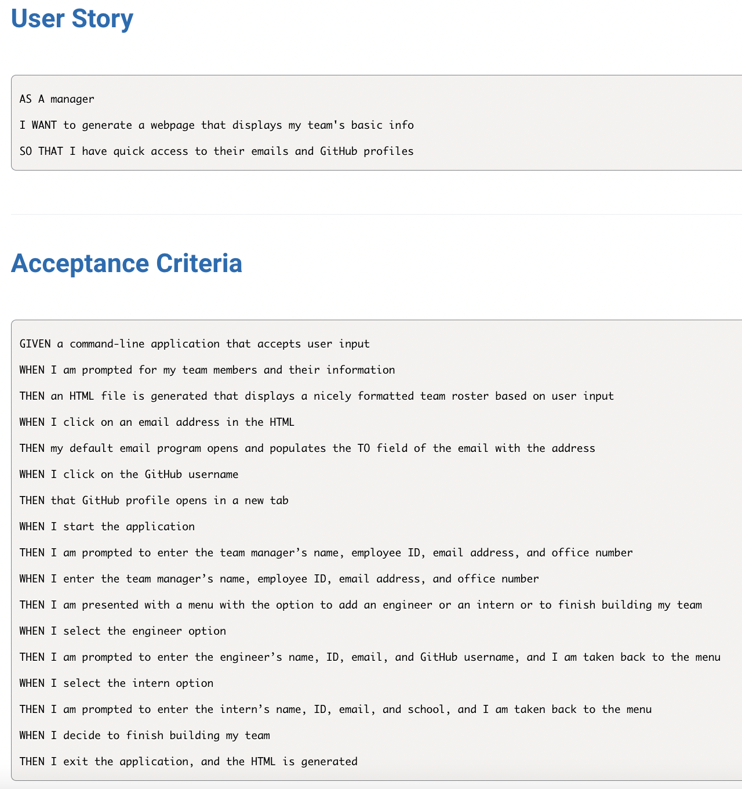
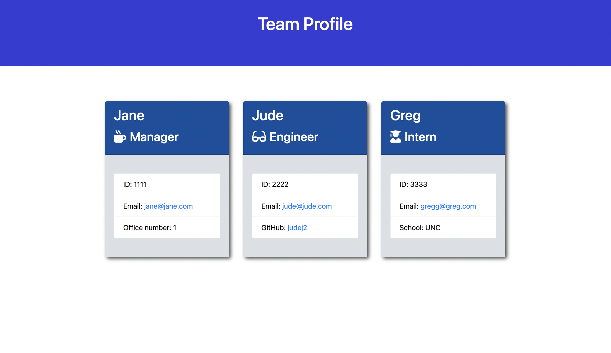

# Team Profile Generator 

_by Latravia Gordon_ 

## Description

Your challenge is to build a Node.js command-line application that takes in information about employees on a software engineering team and generates an HTML webpage that displays summaries for each person. Because testing is key to making code maintainable, you’ll also write unit tests for each part of your code and ensure that it passes all of them.

## Table of Contents

- [Requirements](#requirements)
- [Installation](#installation)
- [Usage](#usage)
- [Screenshot](#screenshot)
- [Tests](#tests)
- [Questions](#questions)
- [License](#license)

## Requirements

## Installation

The user should clone the repository then download Node. Run `npm install`, then add the dependency `npm inquirer`.

## Usage

To begin profile generator run `node index.js` in your command line.

[Video Demo](./utils/team_generator_walkthrough.webm)

## Screenshot

## Tests

Please install the Jest package using the following command, `npm install --save-dev jest`. Then run `npm run test` when you're ready to test.

## Questions

For any questions about the project, please contact me by either of the following links:

- Email = gordonlc18@gmail.com
  or visit my GitHub profile:
- GitHub - [gordonlc18](https://github.com/gordonlc18)

# License

This project is licensed under the MIT license.
